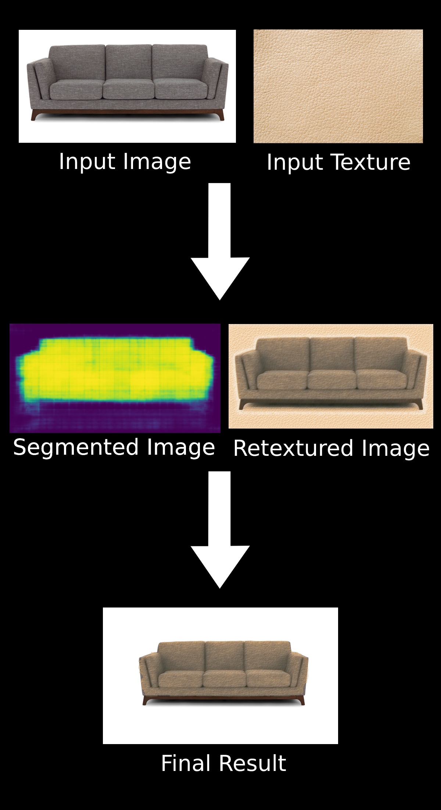

# Couch Material Changer
Uses image segmentation and style transfer to change the materials of a couch. The segmentation model reached a validation loss of 0.2 and a binary IOU of 0.8.

## Input to Output Diagram

